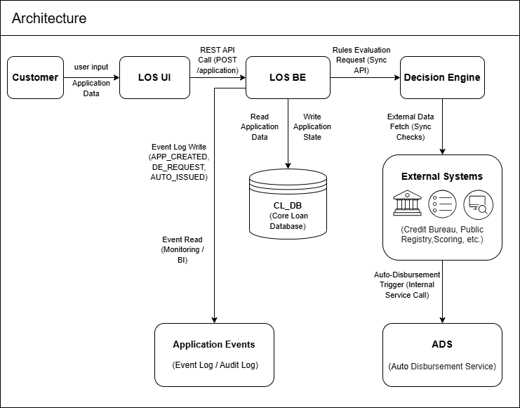
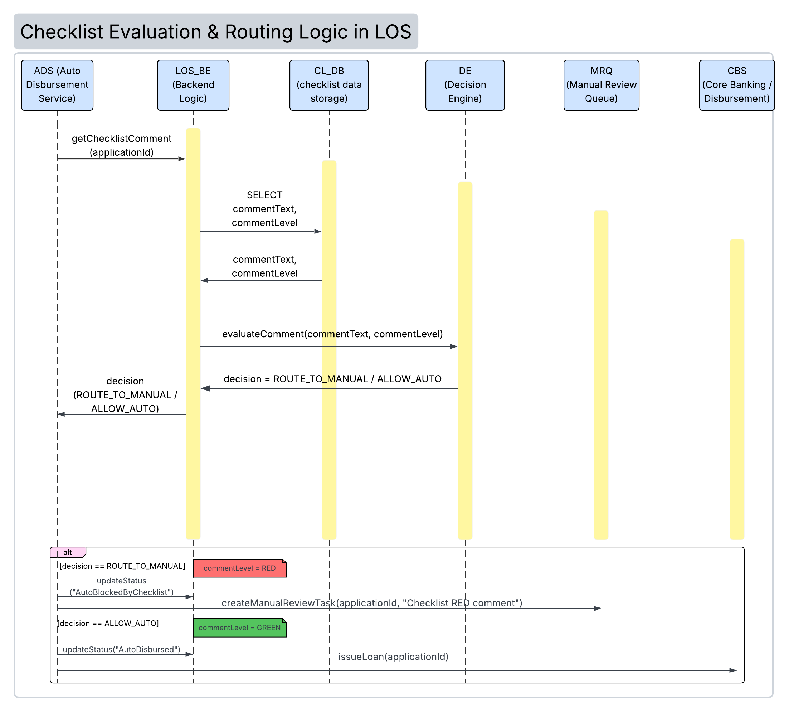
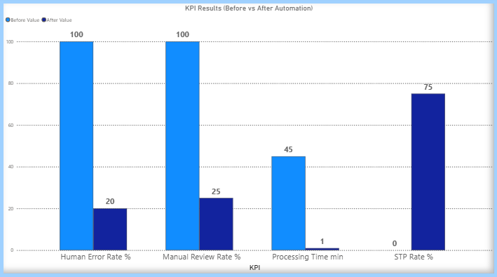
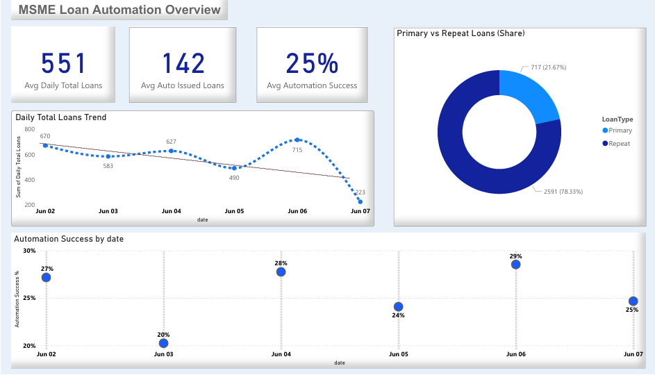

# 📊 Loan Automation in LOS - Data & Analytics Case Study

This repository presents a complete **Data/Analytics case study** evaluating the impact of automated loan issuance within the Loan Origination System (LOS).  
The project includes technical architecture, workflow mapping, SQL-based KPI calculations, event-log analytics, and BI dashboard validation.

---

## 🧭 Project Type
**Data / Analytics Case Study**  
Tools: SQL • Event Logs • BI Dashboards • UML/BPMN • Architecture Modeling

---

# 🏗 1. Architecture Overview

The following diagram illustrates how LOS components, external systems, and automation services interact during the loan issuance process.



**Key Components**
- **LOS UI & Backend** - handles application intake  
- **External Systems** - bureau, registry, scoring data sources
- **Decision Engine** - runs rule validation (LTV, PTI, score, checklist) 
- **Auto Disbursement Service (ADS)** - performs instant loan disbursement  
- **Core Banking** - final posting and account updates  

---

# 🔀 2. Automated vs Manual Workflow

Repeat-loan applications follow one of two routing paths:

### **Automated Path (STP - under 1 minute)**
- All Decision Engine rules pass  
- LOS auto-issues the loan  
- ADS executes automatic disbursement  

### **Manual Review Path (20-30% of repeat loans)**
- Triggered by missing data or failed rule checks  
- Routed to a human checker  
- Before automation: **100%** of repeat loans required manual review  


---

# 📡 3. Sequence Diagram (System Interaction Flow)

This diagram shows how LOS retrieves the checklist comment, sends it to the Decision Engine for evaluation, and based on the result either creates a manual review task (RED) or triggers automatic disbursement via ADS and CBS (GREEN).  




---

# 🔁 4. Data & Analytics Pipeline

This diagram shows how operational data flows into SQL-based analytics and BI dashboards:

1. LOS generates `loan_applications` data  
2. Decision Engine produces rule results  
3. `application_events` logs timestamps  
4. SQL aggregates KPIs  
5. Dashboard visualizes performance over time  


---

# 🧮 5. SQL Logic for KPI Measurement

## **5.1 Manual Review Rate**

```sql
WITH repeat_loans AS (
    SELECT
        application_id,
        DATE(created_timestamp) AS dt,
        is_manual_review
    FROM loan_applications
    WHERE is_repeat_loan = 1
)
SELECT
    dt,
    ROUND(
        100.0 * SUM(CASE WHEN is_manual_review = 1 THEN 1 ELSE 0 END)
        / NULLIF(COUNT(*), 0),
        2
    ) AS manual_review_rate_pct
FROM repeat_loans
GROUP BY dt
ORDER BY dt;
```
Returns the daily percentage of repeat-loan applications that were routed to manual review.

---

## **5.2 Processing Time (Event-Based Duration)**  
Measures the time between application creation and automated issuance.  
This KPI is calculated using event logs generated by LOS.

```sql
WITH events AS (
    SELECT
        application_id,
        MIN(CASE WHEN event_type = 'APP_CREATED' THEN event_timestamp END) AS created_at,
        MIN(CASE WHEN event_type = 'AUTO_ISSUED' THEN event_timestamp END) AS auto_issued_at
    FROM application_events
    GROUP BY application_id
)
SELECT
    DATE(created_at) AS dt,
    ROUND(
        AVG(EXTRACT(EPOCH FROM (auto_issued_at - created_at)) / 60.0),
        2
    ) AS avg_auto_processing_min
FROM events
WHERE created_at IS NOT NULL
  AND auto_issued_at IS NOT NULL
  AND auto_issued_at >= created_at
GROUP BY dt
ORDER BY dt;
```
Returns the daily average time (in minutes) from application creation to automatic issuance, based on LOS event logs

---

## **5.3 Daily Total Loan Issuances - MSME**

```sql
SELECT
    DATE(l.issued_at) AS dt,
    COUNT(*) AS total_loan_count
FROM loans l
WHERE DATE(l.issued_at) = :report_date
  AND l.segment = 'MSME'
  AND l.source_bank = 'TBC'
GROUP BY dt
ORDER BY dt;
```
Returns the total number of MSME loans issued on the selected day.

---

## **5.4 Daily Primary Loan Issuances - MSME**

```sql
SELECT
    DATE(l.issued_at) AS dt,
    COUNT(*) AS primary_loan_count
FROM loans l
WHERE DATE(l.issued_at) = :report_date
  AND l.segment = 'MSME'
  AND l.source_bank = 'TBC'
  AND l.is_repeat_loan = 0
GROUP BY dt
ORDER BY dt;
```
Returns the number of first-time (primary) MSME loans issued on the selected day.

---

## **5.5 Daily Second and Subsequent Loan Issuances - MSME**

```sql
SELECT
    DATE(l.issued_at) AS dt,
    COUNT(*) AS second_and_subsequent_count
FROM loans l
WHERE DATE(l.issued_at) = :report_date
  AND l.segment = 'MSME'
  AND l.source_bank = 'TBC'
  AND l.is_repeat_loan = 1
GROUP BY dt
ORDER BY dt;
```
Returns the number of second and subsequent MSME loans issued on the selected day

---

# 📊 6. KPI Results (Before vs After Automation)

Measures automation impact across core operational indicators  
using SQL calculations and BI dashboard validation.

| KPI | Before Automation | After Automation | Measurement Method |
|-----|------------------|------------------|---------------------|
| **Manual Review Rate (Repeat Loans)** | ~100% | **20-30%** | SQL aggregation on `is_manual_review` |
| **Processing Time** | 30–60 minutes | **< 1 minute** | Event timestamps (`APP_CREATED` → `AUTO_ISSUED`) |
| **STP Rate** | ~0% | **70–80%** | Auto-issued / total repeat loans |
| **Human Error Rate** | High | **Significantly reduced** | Exception logs and manual correction volume |

---

## **6.1 KPI Interpretation (Before vs After Automation)**  
Explains what the measured KPIs indicate about system performance after automation.

- Manual review dropped from **100% → 20–30%**, confirming that the majority of repeat-loan applications now follow an automated STP path.
- Processing time decreased from **30–60 minutes → under 1 minute**, validating real-time rule checks and ADS integration.
- STP rate increased to **70–80%**, demonstrating stable and scalable automation.
- Human error significantly declined due to reduced manual intervention.
- Event logs show consistent, predictable automation flow with minimal fallback scenarios.
- Customer experience improved due to instant decisioning.



---

## **6.2 Daily Automation Penetration Rate**
Measures what percentage of all MSME loans issued in a day were processed automatically.

Automation Penetration (%) =
*(Daily repeat loans % of total)* × *(Automation rate within repeat loans)*
Given:
- Repeat loans share = **78%**
- Automation success rate within repeats = **20–30%**

So, **15.6–23.4% of all daily MSME issuances are now fully automated.**

---

## **6.3 KPI Interpretation (Daily Automation Penetration Rate)**
- Although automation applies *only* to second & subsequent loans,  
- it still automates **15.6–23.4%** of the bank’s entire daily MSME issuance volume.



---

## **7. Insights (Executive Summary)**  
Key analytical and operational takeaways drawn from KPI behavior and process observation.

- Automation sharply improved **operational efficiency** and reduced manual workload.
- **Consistency increased**, as rule-based processing removed variability in decisions.
- **Processing time dropped** from tens of minutes to under one minute, improving customer experience.
- Around **15.6–23.4%** of all daily MSME loans are now fully automated, showing strong early adoption.
- The team achieves **higher throughput without additional resources**, while manual reviews focus only on true exceptions.

---

## **8. Conclusion (Simplified)**  
Summarizes the measurable business impact of introducing automated loan issuance in LOS.

- The automation of second and subsequent MSME loans delivered clear efficiency gains: manual review dropped from **100% → 20–30%**, processing time fell to **under one minute**, and **15.6–23.4%** of all daily issuances are now fully automated.
- These improvements strengthened decision consistency, reduced human error, and enhanced customer experience, while enabling higher throughput with the same operational capacity.


This case study demonstrates how **automation + analytics + SQL-driven measurement** can transform banking processes at scale.
